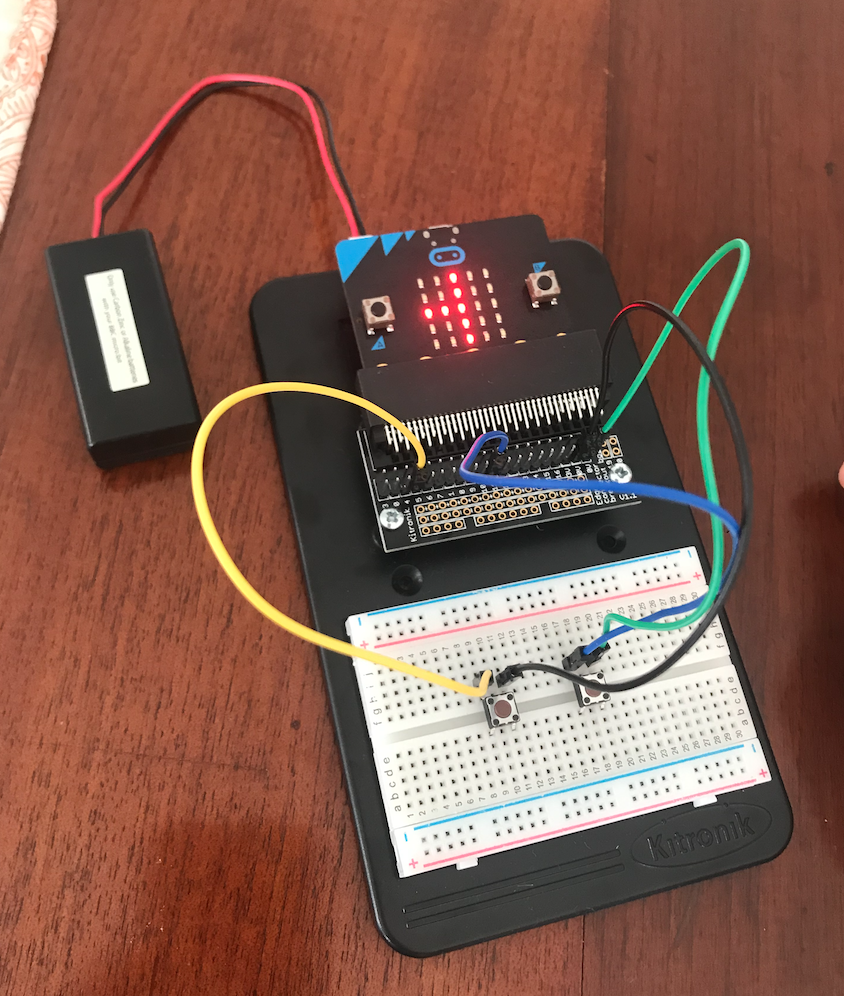
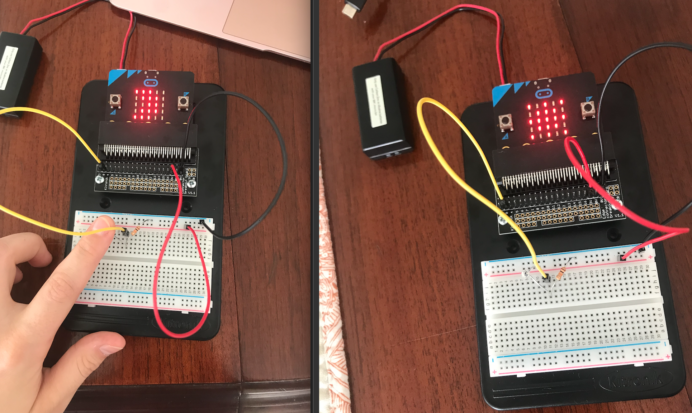
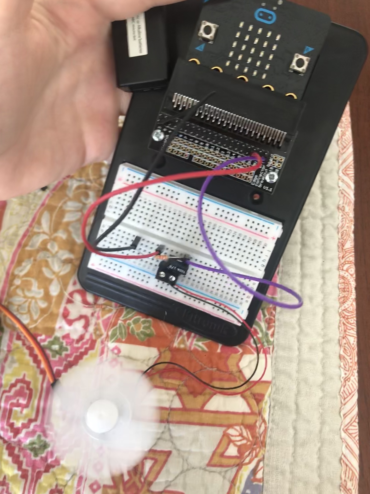
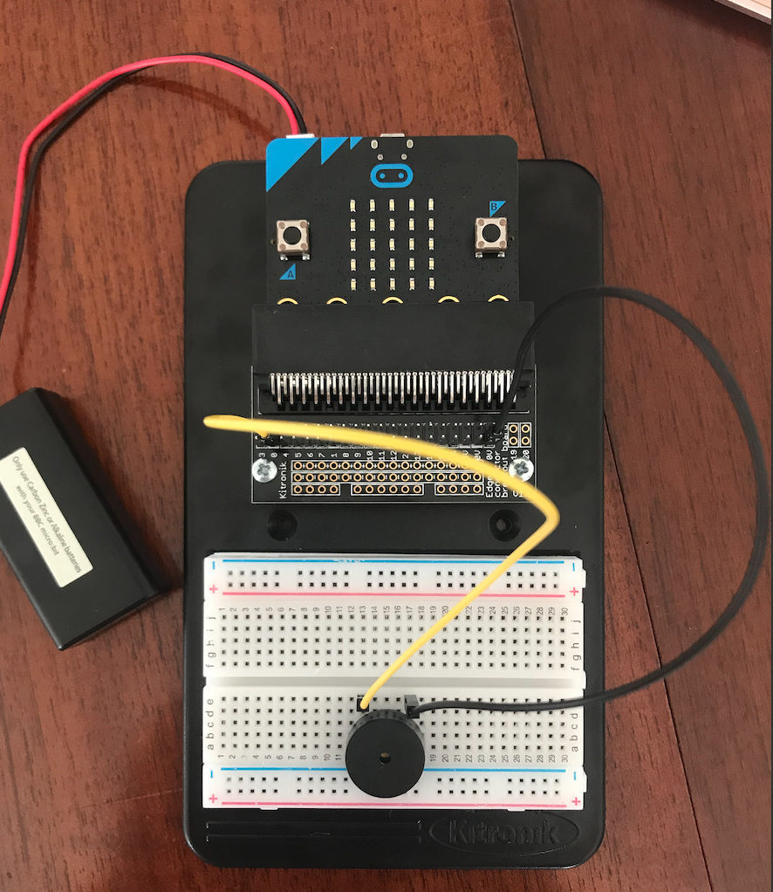
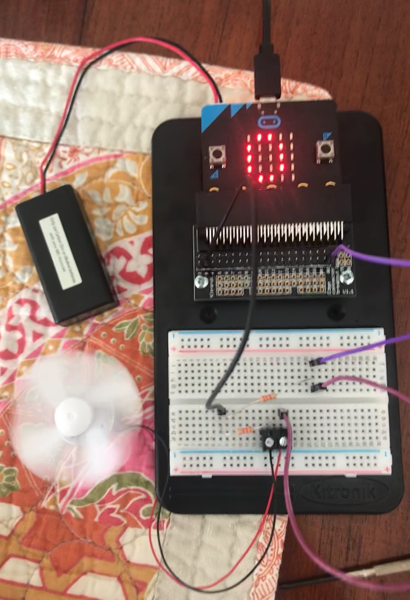

# Inventor Kit Experiments

### Experiment 1 ###

#### Photo of completed project ####

#### Reflection ####

This was my fisrt ever experience with coding and using mirobit. It was fun to get a first insight into how coding works with this simple exercise. 

This experiment could be the basis of a real world application such as electronic signs and advertisments. Things such as road signs, outside of buisnesses.

### Experiment 2 ###

#### Photo of completed project ####

#### Reflection ####

In this experiment, I learnt how to use a light sensor and analog inputs. I liked this expeiment because it allowed me to play around with the sensitivity of the phototransistor.

This experiment could be the basis of a real world application such as energy saving applianes. An appliance with a light sesor such as this could be used to save power by turning lights off during the day and on at night. 

### Experiment 5 ###

#### Photo of completed project ####

#### Reflection ####

In this experiment, I learnt how to use an accelerometer to control motor speed. This experiment could be the basis of a real world application such as video games with remotes that detect movement. It could also be used to control machinery (such as an excavator).

### Experiment 6 ###

#### Photo of completed project ####

#### Reflection ####

In this experiment, I learnt set the tone on a piezo buzzer. This is useful for sending messages and creating music.

### Expriment 7 ###

#### Photo of completed project ####

#### Reflection ####

This experiment was interesting because I used Javascrispt instead of the blocks to write the code. I found Javascript more challenging than the blocks but I can see that with experience you would be able to write code much faster with Javascript than with the blocks.

