# Assessment 1: Replication project

## Replication project choice ##
Banana Keyboard

### Related project 1 ###
Tickle Me Elmo

https://www.youtube.com/watch?v=IP8DHiYJzak

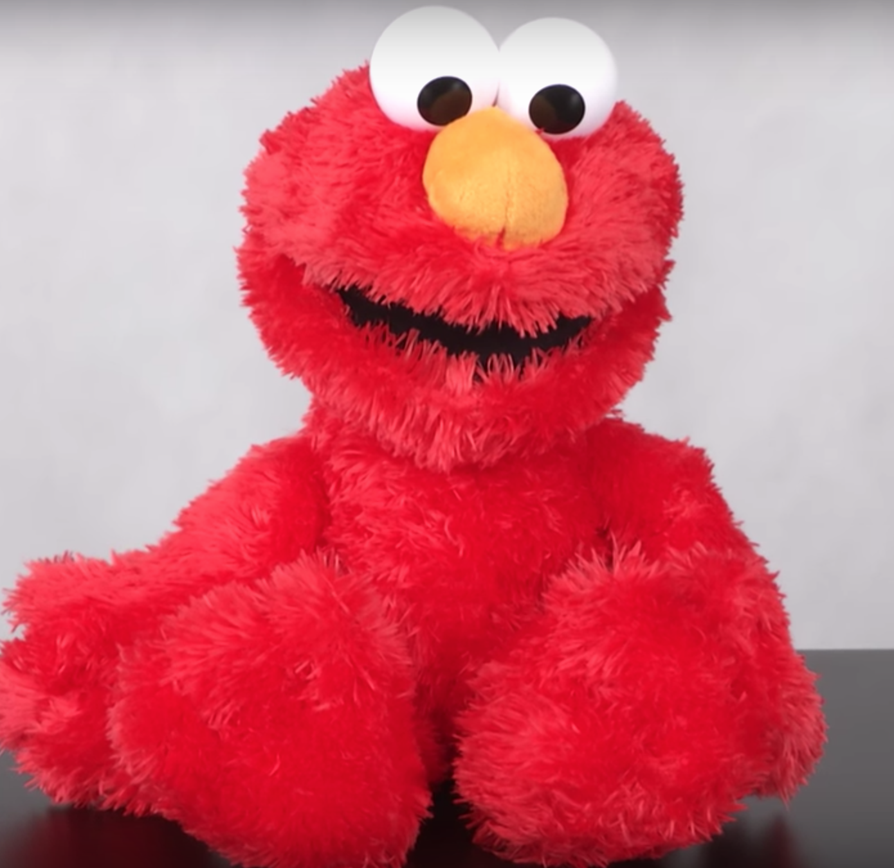

This project is related to mine because it invloves button pushing with simple reactions from the toy. Tickle Me Elmo has a few different sounds and movements programmed for when buttons on the toy are pressed. Similar to mine the lemon is a button that makes a noise when preed and has a few different set noises.

### Related project 2 ###
Pixel Pyros

https://vimeo.com/77432808

This project is related to mine because it invloves an interactive touch. The auience can interact with the projected image without any instruction. Any kind of touch on the wall will produce a reaction in the projection.

### Related project 3 ###
Reactable

https://www.youtube.com/watch?v=jtjNU0Fs3og&feature=youtu.be

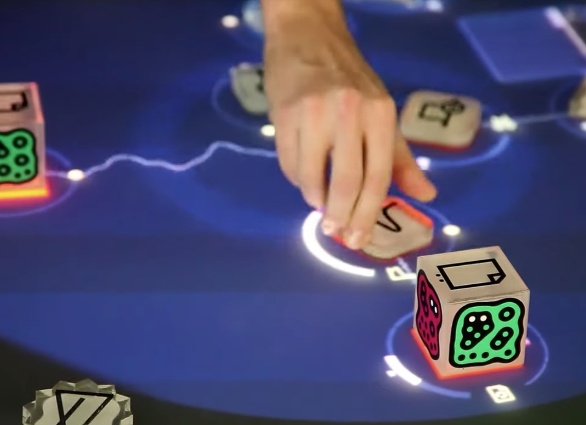

This project is related to mine because it includes sound that is triggered by the user. Unlike mine the sounds are specifically controlled by the user and can be adjusted to create music.

## Reading reflections ##

### Reading: Don Norman, The Design of Everyday Things, Chapter 1 (The Psychopathology of Everyday Things) ###

*What I thought before: 
Before reading this I would always feel silly for interacting with something wrong. A common example described in the reading is doors and how they can be misleading. A door that has a handle on it which signifies pull when the door is in fact meant to be pushed had always left me feeling frustrated for using the appliance wrong.

*What I learned: 
I learnt that it is not the users fault for using an appliance wrong. If a signifier does not clearly communicate the affordance then the person using said product has to revert to trial and error to figure out how it works. Such as with a door that has the wrong signifier, the frustration of pulling and then having to push could be avoided by having a better signifier.

*What I would like to know more about:
I'd like to learn more about hidden signifiers that we follow every day without noticing.

*How this relates to the project I am working on:
My project has a very simple affordance which is to make a noise when the button is triggered. Currently it does not have any signifiers so if someone was to try and use it they probably wouldn't be able to figure out it's function.

### Reading: Chapter 1 of Dan Saffer, Microinteractions: Designing with Details, Chapter 1 ###

*What I thought before:
That microinteractions were things that you barely noticed and wouldnt make a huge difference to your experience while using a device

*What I learned: 
Microinteractions can make up every part of an electronic device or app. Whether there is only one interaction or a thousand. Each one can be the reason that the person using the product loves or hates that product.

*What I would like to know more about: 
I would like to know more about the microinteractions that changed the way that we use and view technology.

*How this relates to the project I am working on: 
My project's microinteraction is to make a noise through completeing a circuit. As a microinteraction it isnt a very good one because it requires a lot of interaction from the user to get to the outcome.

### Reading: Scott Sullivan, Prototyping Interactive Objects ###

*What I thought before: 
I throught that codeing was very complex and that only someone who has studied codeing could efficiently use the software.

*What I learned: 
Codeing can be used as simple building blocks as well as for complex modeling. Codeing can start off simply but as more problems and needs are identified the code gets more complex and specific to the task.

*What I would like to know more about: 
I would like to know more about the different types of codeing and how they can be used in real life situations

*How this relates to the project I am working on: 
More research on how people interact with a product can always be done and improvements can always be made. Having a product that just works isn't good enough when we have access to so many codeing resources.

## Interaction flowchart ##

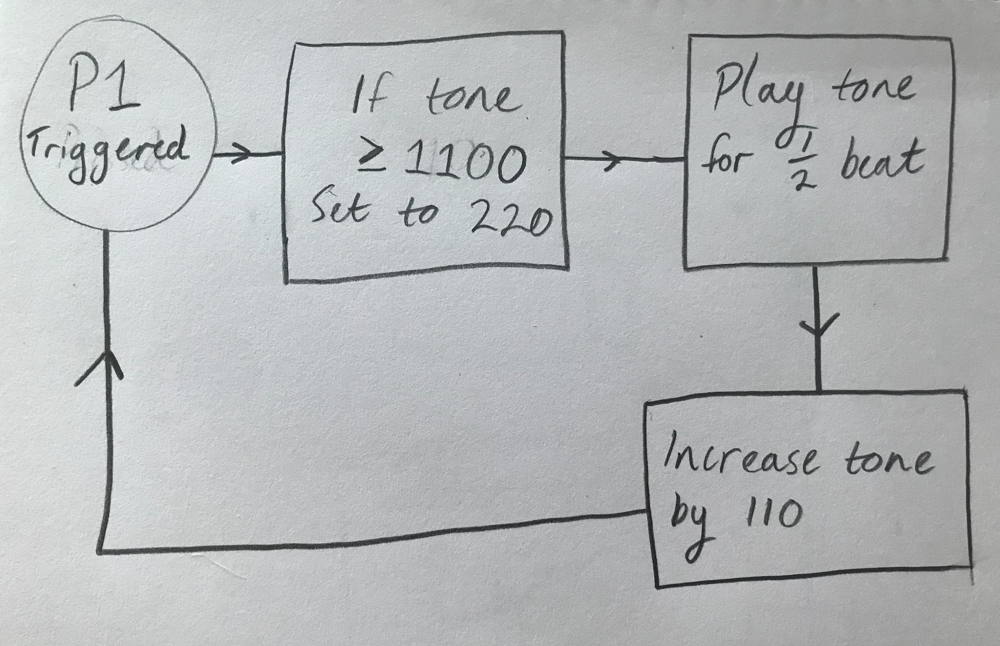

## Process documentation

Here is the first code that I started with from the source that was provided in the assessment. I knew that I wanted to change the code so that it could do more than play the same sound each time. I also knew I didn't want to use a banana because that would get nasty fast.
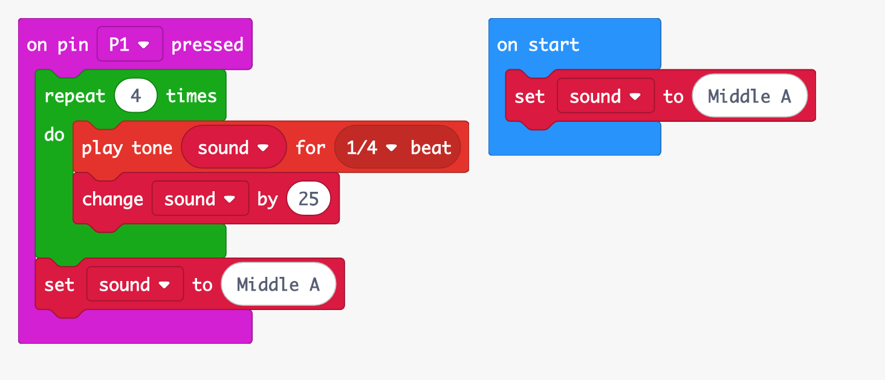

Here I am checking to make sure that my circuit works.
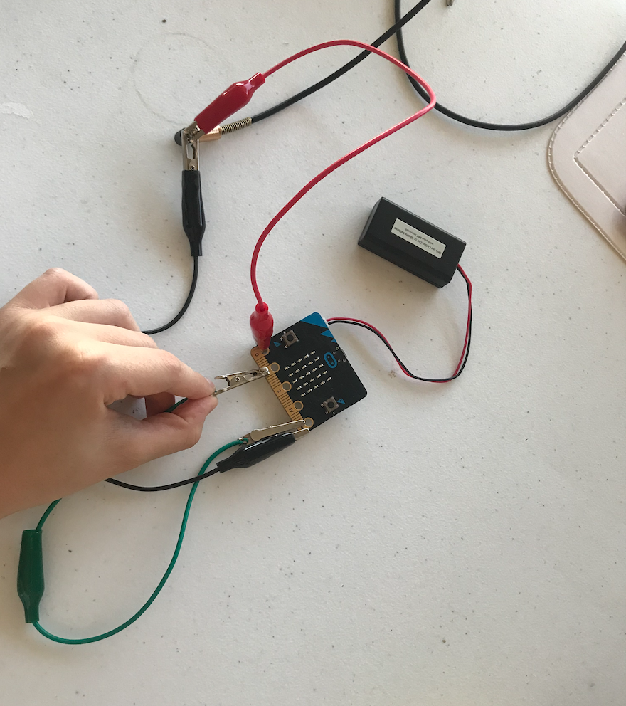

Some close ups of how I connected the microbit chip and aux chord.
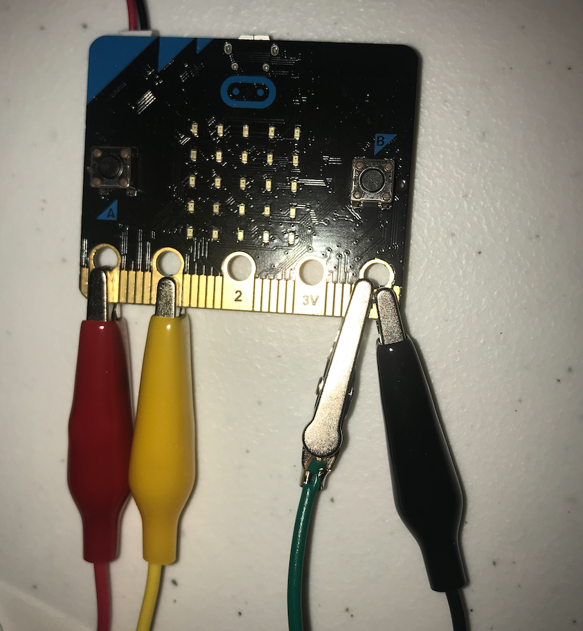
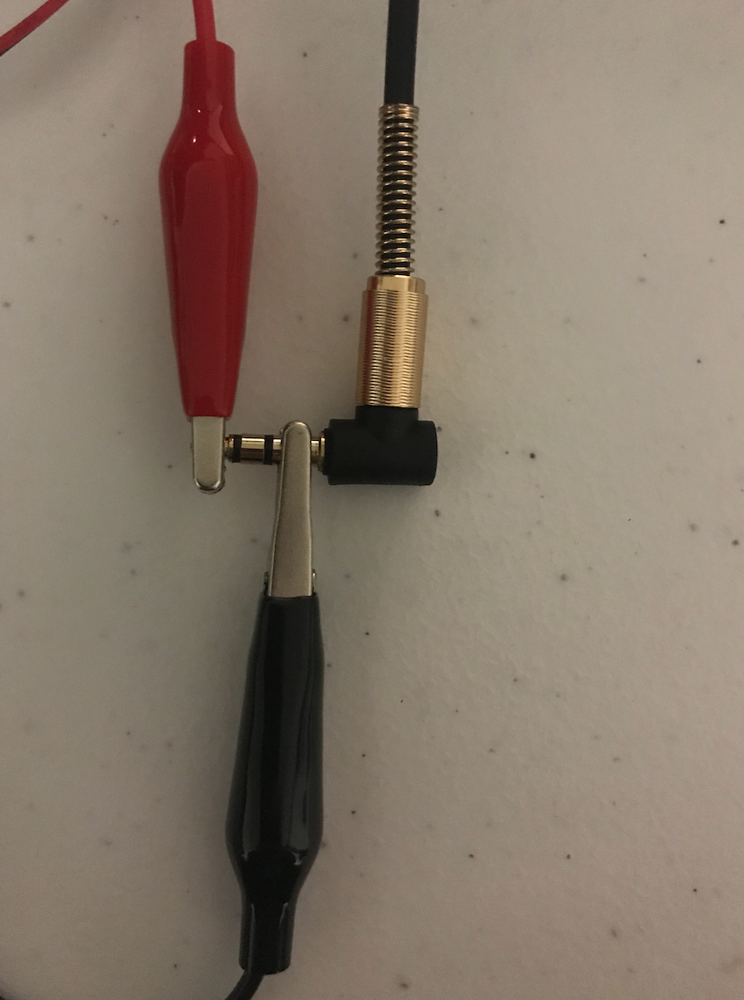

 Here I was panicking because it was not working but turns out it was just the batteries out of power.
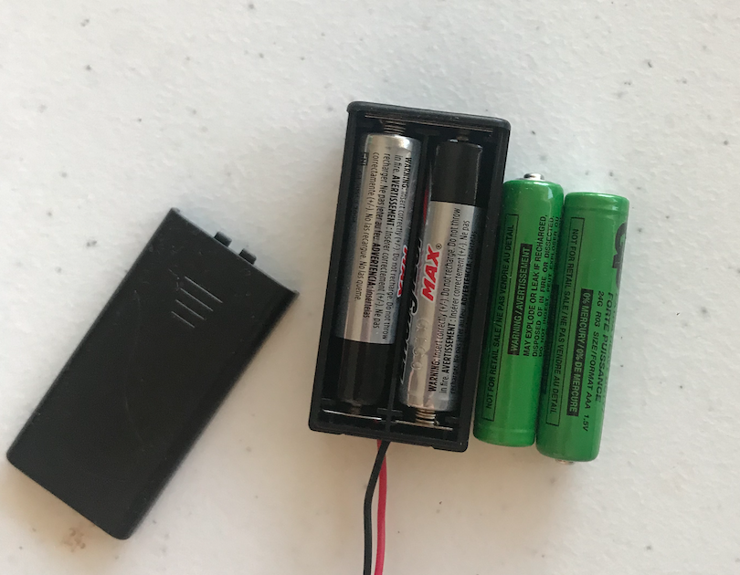

I decided to use a lemon because it seemed to be the least gross option from my kitchen. Here is me testing to see if the signal would travel through the lemon.
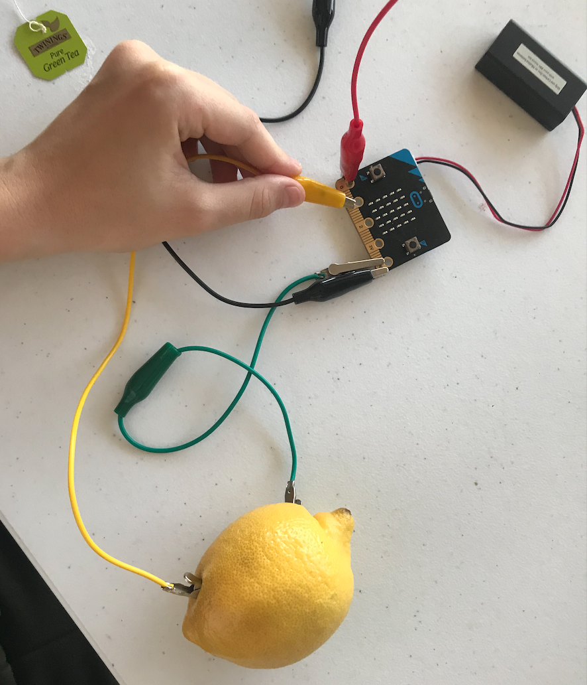

This codeing was my favorite part of my project because I feel that it makes the interaction so much more interesting. By changing the code to make the sound arpeggiate it gives the project a bunch of different noises and the user is more entertained and engaged when using it.
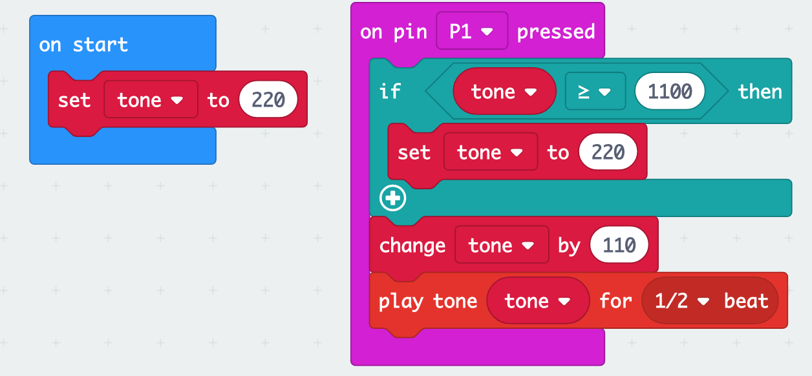

## Project outcome ##

### Lemon Keyboard ###

### Project description ###

By holding 1P in one hand and the fruit, which is connected to Ground in the other, the user acts as a button and close the electrical circuit. Electricity travels from the battery pack, through the microbit, the cables, the fruit and through the user. The result is that there is an electrical connection between 1P and Ground. This tells the microbit to play a sound. To make my project more interesting I made the sound arpeggiate higher each time you touch the lemon.  After the noise is made, the microbit  is programmed to play a higher noise for every sound played until it reaches 1100Hz. Then the microbit reverts back to 220Hz. My project is mainly aimed at children (even though my parents liked playing with it) and could be used as an educational toy that displays how electricity can flow through certian medium.

### Showcase image ###

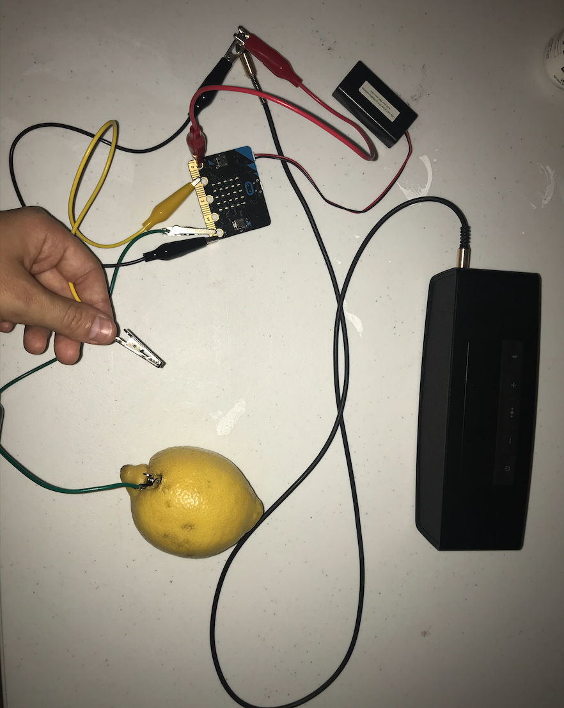

### Additional view ###

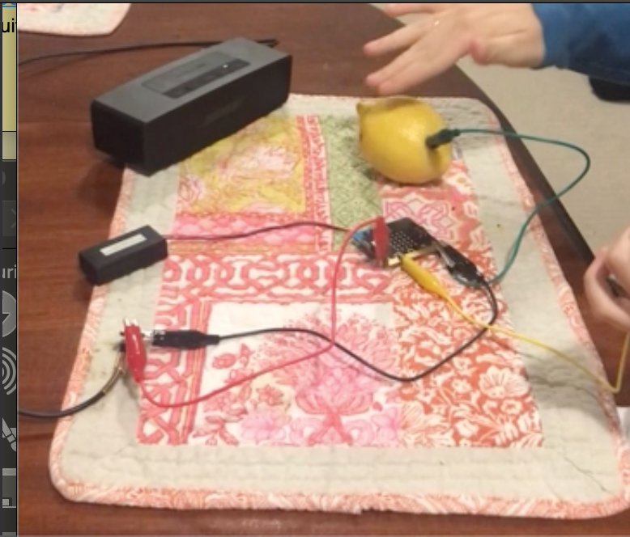

### Reflection ###

*Describe the parts of your project you felt were most successful and the parts that could have done with improvement, whether in terms of outcome, process, or understanding.*

I felt that my project was successful in replicating the provided task and in putting a bit more creativity to the banana keyboard. However, I feel that the presentation could have been improved. The wires were messy and the joins were flimsy; often getting in the way or disconnecting. If I was to create this again I would wrap wires around each connection to make them more secure and tape them down so that there aren't any loose wires. I would also use a box to hide everything exvept the wires that connect to the person and the lemon.

*What techniques, approaches, skills, or information did you find useful from other sources (such as the related projects you identified earlier)?*

My related projects showed me that a project is most successful when it sparks interest. Tickle Me Elmo is interesting for children while the Reactable project is interesting for musicians. The Pixel Pyros project showed me that a project can be very entertaining when it is designed so tat everyone can interact with it. I tried to design my project so that it is entertaining and easy for most people to use. 

*What ideas have you read, heard, or seen that informed your thinking on this project? (Provide references.)*

Scott Sullivan's "Prototyping Interactive Projects" changed my thinking on how a project can evolve from the input from a consumer and the beta testing. When Sullivan first started his project he had set out to just create a device that tracks human movement. He then aspplied that to a retail store setting and other challenges prestented themselves and more testing had to be done to overcome those challenges. This showed me that you need to test your project in different settings to expand upon your knowlege of the product.  “Microinteractions: Designing with Details” by Dan Saffer also taught me that a product is made up of interactions that can make a user either love or hate that device. A developer should always be looking for a way to make a product easier to use. The same notion is brought up by Don Norman in his book “The Design of Everyday Things." He says the the design of products should be intuitive for the user and that the affordances of that product should be signified so that the product is easy to use. This made me think on the design of my product because if an uninformed person came into contact with my product then they wouldn't know what it did or how to use it. Going into the future I'd like to make my project more intuitive for people to use with ease.

*What might be an interesting extension of this project? In what other contexts might this project be used?*

There are many different ways that the principals of this project could be used for. One is education because this project clearly demonstrates the flow of electricity through various objects and materials. I think that this experiment could be used as a teaching tool for how circuts, conductivity and codeing work. It could also be extended into a fun musical instrument by adding more pieces of fruit that make different noises.
