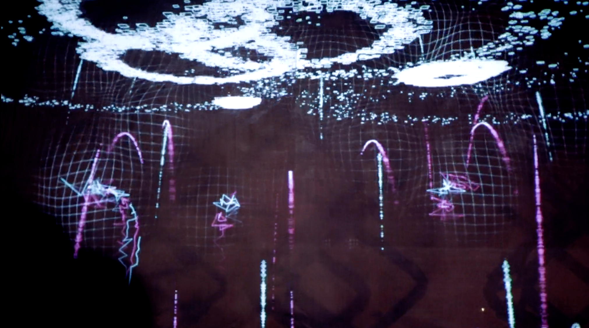

# Assessment 1: Replication project

*Fill out the following workbook with information relevant to your project.*

*Markdown reference:* [https://guides.github.com/features/mastering-markdown/](http://guides.github.com/features/mastering-markdown/)

## Replication project choice ##
Banana Keyboard

### Related project 1 ###
Tickle Me Elmo

https://www.youtube.com/watch?v=IP8DHiYJzak

This project is related to mine because it invloves button pushing with simple reactions from the toy. Tickle Me Elmo has a few different sounds and movements programmed for when buttons on the toy are pressed. Similar to mine the lemon is a button that makes a noise when preed and has a few different set noises.

### Related project 2 ###
Pixel Pyros

https://vimeo.com/77432808

This project is related to mine because it invloves an interactive touch. The auience can interact with the projected image without any instruction. Any kind of touch on the wall will produce a reaction in the projection.

### Related project 3 ###
Reactable

https://www.youtube.com/watch?v=jtjNU0Fs3og&feature=youtu.be

This project is related to mine because it includes sound that is triggered by the user. Unlike mine the sounds are specifically controlled by the user and can be adjusted to create music.

## Reading reflections ##

### Reading: Don Norman, The Design of Everyday Things, Chapter 1 (The Psychopathology of Everyday Things) ###

*What I thought before: 
Before reading this I would always feel silly for interacting with something wrong. A common example described in the reading is doors and how they can be misleading. A door that has a handle on it which signifies pull when the door is in fact meant to be pushed had always left me feeling frustrated for using the appliance wrong.

*What I learned: 
I learnt that it is not the users fault for using an appliance wrong. If a signifier does not clearly communicate the affordance then the person using said product has to revert to trial and error to figure out how it works. Such as with a door that has the wrong signifier, the frustration of pulling and then having to push could be avoided by having a better signifier.

*What I would like to know more about:
I'd like to learn more about hidden signifiers that we follow every day without noticing.

*How this relates to the project I am working on:
My project has a very simple affordance which is to make a noise when the button is triggered. Currently it does not have any signifiers so if someone was to try and use it they probably wouldn't be able to figure out it's function.

### Reading: Chapter 1 of Dan Saffer, Microinteractions: Designing with Details, Chapter 1 ###

*What I thought before:
That microinteractions were things that you barely noticed and wouldnt make a huge difference to your experience while using a device

*What I learned: 
Microinteractions can make up every part of an electronic device or app. Whether there is only one interaction or a thousand. Each one can be the reason that the person using the product loves or hates that product.

*What I would like to know more about: 
I would like to know more about the microinteractions that changed the way that we use and view technology.

*How this relates to the project I am working on: 
My project's microinteraction is to make a noise through completeing a circuit. As a microinteraction it isnt a very good one because it requires a lot of interaction from the user to get to the outcome.

### Reading: Scott Sullivan, Prototyping Interactive Objects ###

*What I thought before: Describe something that you thought or believed before you read the source that was challenged by the reading.*

*What I learned: Describe what you now know or believe as a result of the reading. Don't just describe the reading: write about what changed in YOUR knowledge.*

*What I would like to know more about: Describe or write a question about something that you would be interested in knowing more about.*

*How this relates to the project I am working on: Describe the connection between the ideas in the reading and one of your current projects or how ideas in the reading could be used to improve your project.*

## Interaction flowchart ##

## Process documentation

*In this section, include text and images that represent the development of your project including sources you've found (URLs and written references), choices you've made, sketches you've done, iterations completed, materials you've investigated, and code samples. Use the markdown reference for help in formatting the material.*

*This should have quite a lot of information!*

*There will likely by a dozen or so images of the project under construction. The images should help explain why you've made the choices you've made as well as what you have done. Use the code below to include images, and copy it for each image, updating the information for each.*

*Include screenshots of the code you have used.*

## Project outcome ##

*Complete the following information.*

### Lemon Keyboard ###

### Project description ###

*In a few sentences, describe what the project is and does, who it is for, and a typical use case.*
My project is a lemon keyboard. By holding the end of a cable (P1) in one hand and touching the lemon (Ground) with the other you complete the circut and the keyboard plays a sound. To make my project more interesting I made the sound arpeggiate higher each time you touch the lemon and when it reaches 1100Hz it returns back to 220Hz. This is mainly aimed at children (even though my parents liked playing with it) 

### Showcase image ###

*Try to capture the image as if it were in a portfolio, sales material, or project proposal. The project isn't likely to be something that finished, but practice making images that capture the project in that style.*

### Additional view ###

*Provide some other image that gives a viewer a different perspective on the project such as more about how it functions, the project in use, or something else.*

### Reflection ###

*Describe the parts of your project you felt were most successful and the parts that could have done with improvement, whether in terms of outcome, process, or understanding.*
I felt that my project was successful in replicating the provided task and in putting a bit more creativity to the banana keyboard. However, I feel that the presentation could have been improved. The wires were messy and the joins were flimsy; often getting in the way or disconnecting. If I was to create this again I would wrap wires around each connection to make them more secure and tape them down so that there aren't any loose wires. I would also use a box to hide everything exvept the wires that connect to the person and the lemon.

*What techniques, approaches, skills, or information did you find useful from other sources (such as the related projects you identified earlier)?*

*What ideas have you read, heard, or seen that informed your thinking on this project? (Provide references.)*

*What might be an interesting extension of this project? In what other contexts might this project be used?*
There are many different ways that the principals of this project could be used for. One is education because this project clearly demonstrates the flow of electricity through various objects and materials. I think that this experiment could be used as a teaching tool for how circuts, conductivity and codeing work. It could also be extended into a fun musical instrument by adding more pieces of fruit that make different noises.
